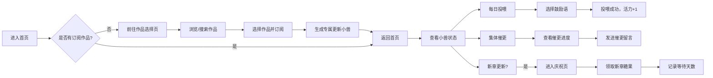

## 1. 产品概述

「更新小兽」是一款面向漫画/小说粉丝的追更养成小游戏，将等待更新的焦虑转化为每日陪伴的温暖体验。用户为每部订阅作品生成一只专属"更新小兽"，通过每日投喂、集体催更、新章庆祝等轻互动，让追更过程充满情绪价值。

- **目标用户**：喜欢漫画、网文、小说的年轻粉丝群体，享受轻松互动和养成乐趣
- **核心价值**：把等待更新的负面情绪转化为陪伴感和仪式感，营造同好社群的温暖氛围
- **产品定位**：偏趣味的轻养成工具，不强调数据效率，注重情绪价值和互动乐趣

## 2. 核心功能

### 2.1 用户角色
| 角色 | 注册方式 | 核心权限 |
|------|----------|----------|
| 普通用户 | 无需注册，本地存储 | 订阅作品、投喂小兽、参与催更、领取糖果 |

### 2.2 功能模块
1. **首页（小兽养成页）**：展示所有订阅作品的小兽，显示小兽状态，可进行投喂操作
2. **作品选择页**：浏览/搜索可订阅的作品，添加订阅并生成专属小兽
3. **投喂互动页**：选择鼓励语进行每日投喂签到，提升小兽活力值
4. **集体催更页**：查看同作品粉丝催更进度，添加温和催更留言
5. **新章庆祝页**：作品更新后展示庆祝动画，领取"新章糖果"，记录等待天数

### 2.3 页面详情
| 页面名称 | 模块名称 | 功能描述 |
|----------|----------|----------|
| 首页 | 小兽展示区 | 网格展示所有订阅作品的小兽卡片，显示小兽状态、作品名、上次更新时间 |
| 首页 | 状态提示 | 展示今日是否已投喂、累计等待天数等信息 |
| 首页 | 快捷操作 | 一键投喂全部、进入催更、添加新作品入口 |
| 作品选择页 | 作品列表 | 展示可订阅的漫画/小说作品卡片，带封面和简介 |
| 作品选择页 | 搜索筛选 | 按类型、热度等筛选作品 |
| 作品详情页 | 小兽预览 | 展示该作品专属小兽的形象和初始状态 |
| 投喂互动页 | 鼓励语选择 | 提供多句温和的鼓励话语供选择 |
| 投喂互动页 | 投喂动画 | 投喂后小兽开心反应的动画效果 |
| 集体催更页 | 催更进度 | 显示当前催更人数和目标人数进度条 |
| 集体催更页 | 留言墙 | 展示其他粉丝的温和催更留言 |
| 集体催更页 | 发送催更 | 用户输入/选择催更留言并加入催更 |
| 新章庆祝页 | 庆祝动画 | 撒花、糖果掉落等庆祝效果 |
| 新章庆祝页 | 糖果领取 | 领取新章糖果，记录等待天数 |
| 新章庆祝页 | 分享卡片 | 生成可分享的庆祝卡片 |

## 3. 核心流程

## 4. 用户界面设计

### 4.1 设计风格
- **主色调**：暖橙色系（#FF8C69 主色）搭配奶油白（#FFF8F0 背景），营造温暖治愈的氛围
- **辅助色**：粉色（#FFB5C5）、薄荷绿（#98D8C8）、鹅黄色（#FFE66D）
- **按钮风格**：圆润的胶囊形按钮，带微妙阴影和悬浮放大效果
- **字体**：标题使用圆润可爱的字体，正文使用清晰易读的无衬线字体
- **布局风格**：卡片式布局，大量圆角和柔和阴影，营造轻松愉悦感
- **视觉元素**：大量使用emoji和可爱插画元素，小兽使用SVG绘制

### 4.2 页面设计概览
| 页面名称 | 模块名称 | UI元素 |
|----------|----------|--------|
| 首页 | 小兽卡片 | 圆角卡片，小兽插画在中央，作品名在下方，状态标签（活力/瞌睡），悬浮轻微上浮 |
| 首页 | 顶部栏 | 标题"我的小兽们"，糖果数量显示，添加按钮 |
| 投喂页 | 鼓励语列表 | 气泡式标签，点击选中，多选一 |
| 投喂页 | 小兽反应 | 投喂后小兽跳动、冒爱心动画 |
| 催更页 | 进度条 | 柔和渐变进度条，带人数数字 |
| 催更页 | 留言卡片 | 堆叠式卡片，每条留言带用户头像和昵称 |
| 庆祝页 | 糖果雨 | 全屏糖果飘落动画 |
| 庆祝页 | 糖果徽章 | 金色糖果徽章，显示等待天数 |

### 4.3 响应式
- 采用移动优先设计，适配手机端操作
- 桌面端展示2-3列小兽网格，移动端单列
- 触摸交互优化，按钮尺寸适合指尖点击

### 4.4 动画与交互
- 小兽闲置时有轻微呼吸动画
- 投喂时小兽弹跳+爱心冒出
- 催更人数增加时进度条平滑增长
- 新章庆祝时有糖果雨和彩带动画
- 页面切换使用淡入淡出过渡
