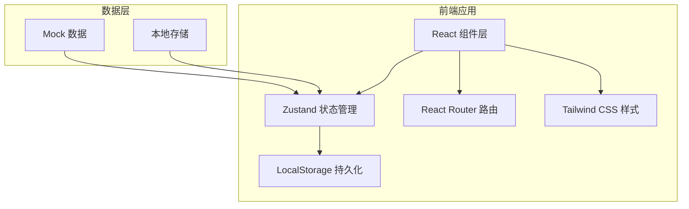
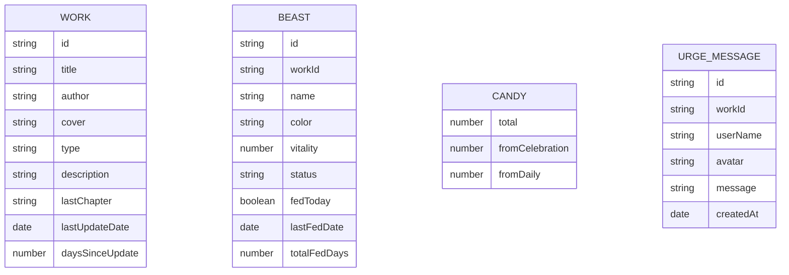

## 1. 架构设计



## 2. 技术描述

- **前端框架**：React 18 + TypeScript
- **构建工具**：Vite 5
- **样式方案**：Tailwind CSS 3
- **状态管理**：Zustand
- **路由管理**：React Router DOM 6
- **图标库**：Lucide React
- **数据持久化**：LocalStorage
- **后端**：无（纯前端应用，使用 Mock 数据）

## 3. 路由定义

| 路由路径 | 页面名称 | 用途 |
|----------|----------|------|
| `/` | 首页 | 展示所有订阅作品的小兽，主入口 |
| `/works` | 作品选择页 | 浏览可订阅作品，添加新订阅 |
| `/feed/:workId` | 投喂页 | 选择鼓励语，投喂小兽 |
| `/urge/:workId` | 催更页 | 查看催更进度，发送催更留言 |
| `/celebrate/:workId` | 庆祝页 | 新章更新庆祝，领取糖果 |

## 4. 数据模型

### 4.1 数据模型定义



### 4.2 状态管理

使用 Zustand 创建全局 store，包含：
- `works`: 所有可订阅作品数据
- `subscribedWorks`: 用户订阅的作品列表
- `beasts`: 每部作品对应的小兽状态
- `candies`: 用户拥有的糖果数量
- `urgeMessages`: 催更留言
- 用户操作方法（订阅、投喂、催更、领取糖果等）

## 5. 项目结构

```
src/
├── components/          # 可复用组件
│   ├── BeastCard.tsx    # 小兽卡片
│   ├── BeastSvg.tsx     # 小兽SVG插画
│   ├── WorkCard.tsx     # 作品卡片
│   ├── CandyBadge.tsx   # 糖果徽章
│   └── NavBar.tsx       # 导航栏
├── pages/               # 页面组件
│   ├── Home.tsx         # 首页
│   ├── Works.tsx        # 作品选择页
│   ├── Feed.tsx         # 投喂页
│   ├── Urge.tsx         # 催更页
│   └── Celebrate.tsx    # 庆祝页
├── store/               # 状态管理
│   └── useGameStore.ts  # 游戏状态 store
├── data/                # Mock 数据
│   └── mockWorks.ts     # 作品数据
├── types/               # 类型定义
│   └── index.ts         # 类型声明
├── utils/               # 工具函数
│   └── storage.ts       # 本地存储工具
├── App.tsx              # 应用根组件
├── main.tsx             # 入口文件
└── index.css            # 全局样式
```

## 6. 核心功能实现思路

### 6.1 小兽状态系统
- 小兽有 `vitality`（活力值）属性，范围 0-100
- 根据作品上次更新时间计算等待天数
- 等待天数越少，活力值越高；等待越久，活力越低
- 每日投喂可恢复一定活力值
- 状态分为：活力满满（>80）、正常（50-80）、困倦（30-50）、瞌睡（<30）

### 6.2 每日投喂
- 每只小兽每天只能投喂一次
- 选择鼓励语后完成投喂，活力值 +10
- 记录连续投喂天数
- 投喂后展示小兽开心动画

### 6.3 集体催更
- 每部作品有催更人数统计（mock 数据模拟）
- 用户可发送一条催更留言
- 催更留言展示在留言墙
- 达到一定人数可生成"应援卡"

### 6.4 新章庆祝
- 当检测到作品更新时（mock 模拟）
- 展示庆祝页面，糖果雨动画
- 用户领取新章糖果
- 记录本次等待了多少天
- 小兽活力值恢复满

### 6.5 本地存储
- 使用 localStorage 持久化用户数据
- 存储订阅作品、小兽状态、糖果数量等
- 页面加载时从 localStorage 恢复数据
